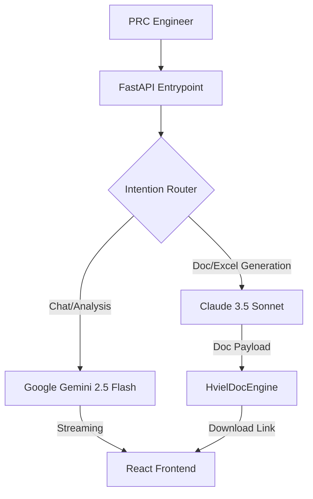

# 🏗 PRC AI Pipeline: Technical Architecture

This document details the internal logic and data flow of the sovereign petrophysical agent.

## 1. Mixture of Experts (MoE) Architecture
The system employs a dual-LLM routing strategy to optimize for both speed and output quality:

## 2. RAG & Semantic Ingestion
The system maintains a sovereign knowledge base of petrophysical literature and project books.
- **Embedding Model**: `text-embedding-004` (Gemini)
- **Vector DB**: PostgreSQL with memory-mapped vector similarity (SQLite fallback on local).
- **Auto-Hydration**: Files in the `/books` directory are automatically ingested on startup if not already present.

## 3. Skills Engine (Hermes)
The agent utilizes a sandboxed skill execution layer:
- **Research**: `search_arxiv.py` fetches academic context.
- **Physics**: `physics_engine.py` and `petrophysics_engine.py` handle mathematical validation.
- **Simulation**: `prc_simulated_annealing.py` optimizes curve fitting for Brooks-Corey models.

## 4. Engineering Cognitive Loop
The prompt engineering forces the agent into a **4-Phase Root Cause Analysis** loop:
1. **Observation**: Identify discrepancies in uploaded data.
2. **Investigation**: Search knowledge base/arXiv for physical precedents.
3. **Simulation**: Execute mathematical tests (e.g., Archie/Brooks-Corey) to validate findings.
4. **Audit**: Present a final engineering verification report, not just a surface fix.

## 5. Security Model
- **Credential `1509`**: Controls access to the `/api/kb/ingest` and `/api/kb/status` endpoints.
- **Sandbox Environment**: All Python simulations are executed in an isolated process space to prevent host contamination.

## 6. Data Accountability (Auditor's Ledger)
To ensure industrial-grade accountability, every interpretation is automatically audited:
- **Ledger Storage**: SQLite `physics_audits` table (persistent across restarts).
- **Verification Hook**: Every plot generation triggers an automatic `PhysicsGuard` validation.
- **Traceability**: Maintains a permanent link between session metadata, source filename, and numerical health scores.

---
*Developed for the Petroleum Research Center Libya.*
