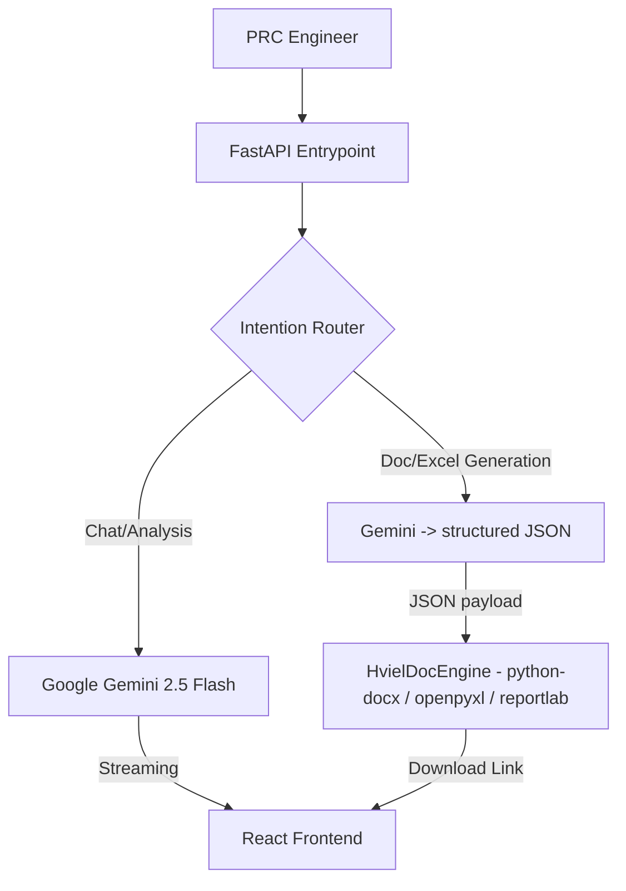

# 🏗 PRC AI Pipeline: Technical Architecture

This document details the internal logic and data flow of the sovereign petrophysical agent.

## 1. LLM & Document Generation Architecture
The system uses a single LLM provider — **Google Gemini** (via the `google-genai` SDK) —
for both conversational analysis and for driving document/spreadsheet generation. There is
no Anthropic/Claude model in the pipeline: `anthropic` was intentionally removed from
`requirements.txt`, and document rendering is performed locally by Python libraries.

- **Chat / Analysis**: Gemini `gemini-2.5-flash` (the active model per `app.py`, with
  `gemini-2.5-pro` used only as an overload fallback in the background task path).
- **Document / Excel generation**: Gemini is asked (with no tools) to emit a structured JSON
  payload via `PRCChatAssistant.generate_document_json()`. That JSON is then handed to
  `HvielDocEngine.build_from_json()`, which renders the actual file **locally** using
  `python-docx` (.docx), `openpyxl` (.xlsx), `python-pptx` (.pptx), and `reportlab` (.pdf).
  No external generation API is involved in producing the file bytes.

## 2. RAG & Semantic Ingestion
The system maintains a sovereign knowledge base of petrophysical literature and project books.
Two distinct retrieval mechanisms exist in the codebase, and only the first is wired into the
live chat flow:

### Live RAG path (used by chat)
This is the `KnowledgeBase` class in `app.py` and is what the chat pipeline actually queries.
- **Embedding Model**: `gemini-embedding-2` (Gemini, via the `google-genai` client) — see
  `EMBED_MODEL` in `app.py`.
- **Storage**: the relational application database (PostgreSQL via `psycopg2`, with a local
  SQLite fallback). Document chunks and their embeddings are persisted as rows in the
  `library_docs` / `library_chunks` tables (the `embedding` column holds the raw float32
  vector bytes); session/history chunks live in the `kb` table.
- **Similarity**: cosine similarity is computed in-memory with NumPy over an in-process
  embedding cache (`_LibraryEmbCache`), not by a dedicated vector engine. There is a keyword
  `LIKE` fallback when embeddings are unavailable.

### ChromaDB analog-wells module (NOT wired into chat)
`rag_database.py` defines a separate `RAGDatabase` class backed by **ChromaDB**
(`chromadb.PersistentClient`, persisted under `./chroma_db`) exposing `ingest_report()` and
`query_analog_wells()`. This is the "analog wells" feature. It is currently referenced only by
the test suite — it is **not imported or called by
`app.py`**, so it does not participate in the live chat/RAG pipeline at this time.

## 3. Skills Engine (Hermes)
The agent utilizes a skill execution layer (`skills_engine.py`, `SkillsEngine`) that runs
scripts under `hermes_skills_library/petroleum/` in a child Python process via
`run_skill(category, skill_name, script_name, args)`. The scripts the chat pipeline in
`app.py` actually invokes are:
- **Simulation**: `simulator/simulation_core.py` — streamed via
  `run_skill_stream("petroleum", "simulator", "simulation_core.py", ...)`.
- **History matching**: `simulator/history_matching_skill.py` — Simulated-Annealing history
  matching on SCAL lab data (the `agentic_history_matching` tool).
- **Curve fitting**: `curve_fitting_skill.py` — Brooks-Corey / relative-permeability fitting.
- **Core petrophysics**: `scalskills/scripts/petrophysics.py` — dispatched for the various
  plot/model modes (MICP, Archie RI/FF, J-function, centrifuge, etc.).

(The previously documented `search_arxiv.py`, `physics_engine.py`, and
`petrophysics_engine.py` do not exist in `hermes_skills_library/petroleum/`.)

## 4. Engineering Cognitive Loop
The prompt engineering forces the agent into a **4-Phase Root Cause Analysis** loop:
1. **Observation**: Identify discrepancies in uploaded data.
2. **Investigation**: Search knowledge base/arXiv for physical precedents.
3. **Simulation**: Execute mathematical tests (e.g., Archie/Brooks-Corey) to validate findings.
4. **Audit**: Present a final engineering verification report, not just a surface fix.

## 5. Security Model
- **Knowledge-base ingestion auth**: The `/api/kb/ingest` endpoint is protected by
  environment-supplied secrets — `KB_INGEST_SECRET` and/or `ADMIN_PIN` (both declared in
  `render.yaml` with `sync: false`). The supplied password is compared against these env vars
  using `hmac.compare_digest` (constant-time comparison); no credential is hardcoded in the
  source. The matching `ADMIN_PIN` mechanism also gates the admin/metrics endpoints. (Note:
  `/api/kb/status` is a read-only status endpoint and is not password-gated.)
- **Sandbox Environment**: Python simulations are executed in a separate child process via the
  Skills Engine (`subprocess`), isolating them from the main server process.

## 6. Data Accountability (Auditor's Ledger)
To ensure industrial-grade accountability, every interpretation is automatically audited:
- **Ledger Storage**: SQLite `physics_audits` table (persistent across restarts).
- **Verification Hook**: Every plot generation triggers an automatic `PhysicsGuard` validation.
- **Traceability**: Maintains a permanent link between session metadata, source filename, and numerical health scores.

---
*Developed for the Petroleum Research Center Libya.*

_Last verified against code: 2026-06-14_
