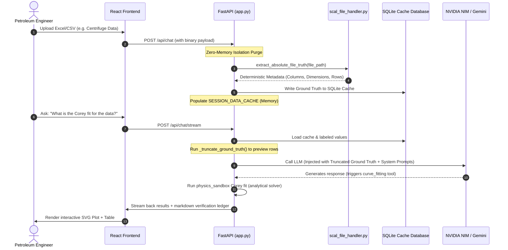

# PRC SCAL AI Hub — Codebase Organization & Architecture Map

This documentation provides an organized, structured map of the **PRC SCAL AI Pipeline (Hviel)** codebase. It is designed to assist data scientists, reviewers, and engineering teams in understanding the layout, data processing pathways, and core mathematical components of the system.

---

## 1. Project Directory Layout

The codebase is organized into modular layers separating the web API, mathematical models, data ingestion, and testing suites:

```
scal-ai-pipeline/
│
├── frontend/                  # React + Vite Glass-Brutalist User Interface
│   ├── src/
│   │   ├── components/        # UI components (Petrophysical Table, Studio, etc.)
│   │   ├── lib/               # Client-side petrophysical math (Corey curve, SVG)
│   │   └── App.jsx            # Main app page state and SSE chat handler
│   └── e2e/                   # Playwright End-to-End tests
│
├── docs/                      # Developer and operator documentation
│   ├── CODEBASE_ORGANIZATION.md # This guide (Architecture & Data Flow)
│   └── DEVELOPER_DOCS.md      # Detailed developer setup and requirements
│
├── prompts/                   # LLM instructions and configurations
│   └── hviel_system_prompt.md # Master Hviel engineering prompt (NVIDIA NIM)
│
├── tests/                     # Unit and system testing suite
│   ├── test_milestone2.py     # Milestone 2 regression validations
│   └── test_physics_and_skills_exhaustive.py # Scientific physics guards
│
├── app.py                     # Primary FastAPI backend, tool-routing, and session cache
├── file_reader.py             # Multi-format document text/table extractor
├── scal_file_handler.py       # Deterministic pre-parsing, metrics ledger, and isolation
├── geological_graph.py        # Geological Graph-RAG and citation verification
├── physics_sandbox.py         # Corey curve-fitting, Washburn simulation, optimization
├── petrophysical_curves.py    # Standard petrophysical mathematical formulas (Corey, LET, Pc)
├── alerting.py                # Telemetry tracker, cost metrics, and Slack alerts
└── config.py                  # Environment variable settings and key pool
```

---

## 2. Ingestion & LLM Query Data Flow

The following sequence details how an uploaded core analysis sheet is parsed, verified, cached, and queried:



---

## 3. Core Module Walkthrough

### 🔬 Scientific & Mathematical Engines
* **[petrophysical_curves.py](file:///c:/Users/Asus/Downloads/scal-ai-pipeline/petrophysical_curves.py):** Implements foundational multiphase flow equations. Includes drainage/imbibition Corey curves, Brooks-Corey curves, LET parameterization, and Archie's Archie-LET saturation/resistivity relationships.
* **[physics_sandbox.py](file:///c:/Users/Asus/Downloads/scal-ai-pipeline/physics_sandbox.py):** Contains the fitting and optimization algorithms. Uses Scipy curve fitting to extract Brooks-Corey exponents ($n_w$, $n_o$) and endpoints ($k_{rwMax}$, $k_{roMax}$) from raw point arrays, and runs Washburn capillary pressure simulations.
* **[physics_validator.py](file:///c:/Users/Asus/Downloads/scal-ai-pipeline/physics_validator.py):** Implements the `PhysicsGuard` safety gate. It verifies that computed parameters fall within physically plausible geological boundaries (e.g., monotonicity of $k_r$, saturation limits, positive Pc).

### 📂 File Processing & Parsing Layer
* **[file_reader.py](file:///c:/Users/Asus/Downloads/scal-ai-pipeline/file_reader.py):** Handles multi-format extraction (PDF, DOCX, TXT, CSV, XLSX). ItSniffs CSV delimiters and extracts tables recursively, converting tabular structures into clean markdown matrices.
* **[scal_file_handler.py](file:///c:/Users/Asus/Downloads/scal-ai-pipeline/scal_file_handler.py):** Contains the deterministic pre-parser (`extract_absolute_file_truth`) that extracts columns and cell values from Excel files before any LLM is called, forming the absolute ground truth.

### 🌐 API & Orchestration
* **[app.py](file:///c:/Users/Asus/Downloads/scal-ai-pipeline/app.py):** Integrates all elements. Sets up routes for file uploads, chat streamings, and engineering tools. Manages the session caches and authentications. It hosts the custom NVIDIA NIM integration shims that parse OpenAI completion payloads back into Gemini schemas.

---

## 4. Key Design Patterns to Observe

1. **Context Truncation Control (`_truncate_ground_truth`):**
   To prevent token-count explosion and backend request timeouts on massive workbooks, large sheets are programmatically truncated to their first 3 and last 3 rows when building prompts. The database cache remains 100% complete so calculations are never affected.
2. **Session Context Isolation:**
   Every new connection triggers `SESSION_DATA_CACHE[session_id].clear()`, strictly confining data to the current session ID to prevent cross-session leakage.
3. **Immutable Provenance Logs:**
   Fittings and data lookups generate a frozen markdown ledger appended directly to the end of the streaming responses, making it easy to audit the origin of every parameter.
